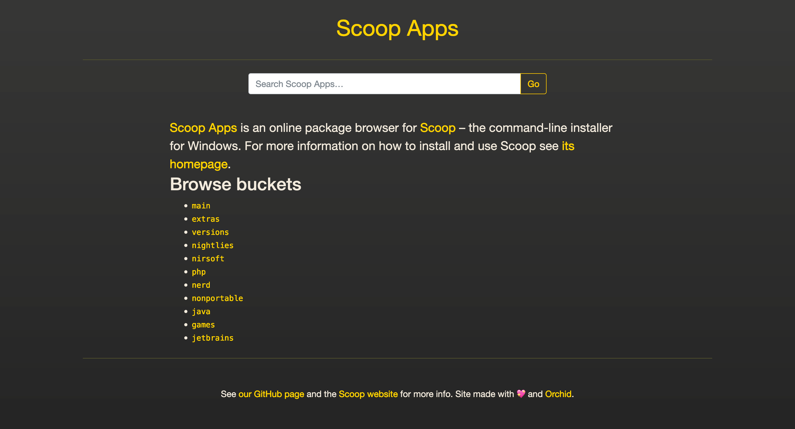
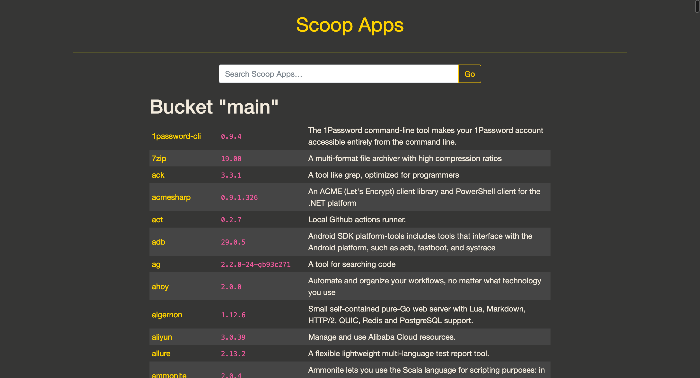
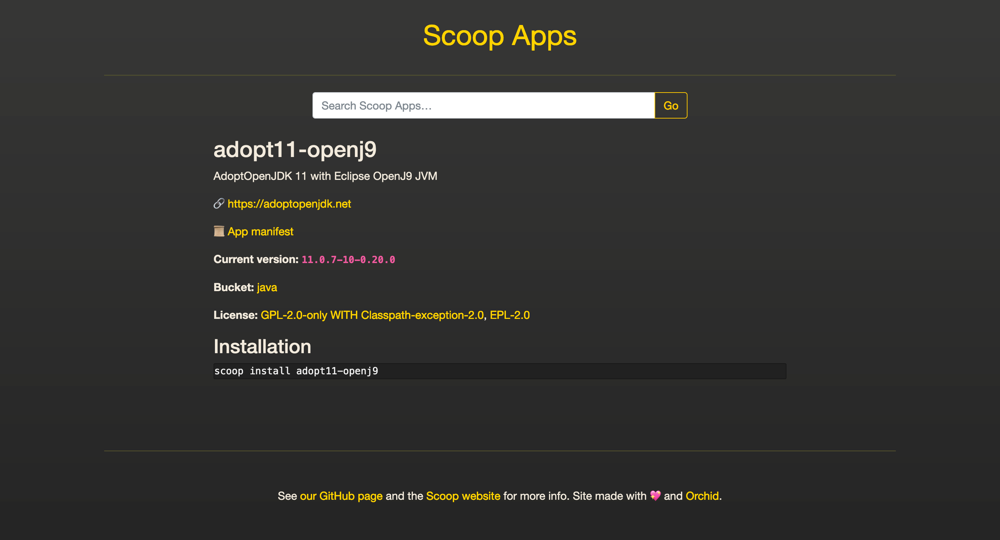

# Scoop Apps

Scoop Apps is an online package browser for <a href="https://scoop.sh/">Scoop</a> – the command-line 
installer for Windows.

<hr>
<p align="center"><b>https://bjansen.github.io/scoop-apps/</b></p>
<hr>

## Status

Since this project was started, a similar browser has been added to the official Scoop website, which kinda makes
this project less useful.

## Screenshots







## Updating the website

```bash
# Update buckets and applications metadata
./gradlew scanBuckets

# Regenerate website from updated metadata
./gradlew -Penv=prod -PURL=https://bjansen.github.io/scoop-apps/ orchidBuild

# Push to GitHub Pages
./gradlew -Penv=prod -PURL=https://bjansen.github.io/scoop-apps/ orchidDeploy

# Update Algolia index (for the search bar)
./gradlew updateAlgolia
```